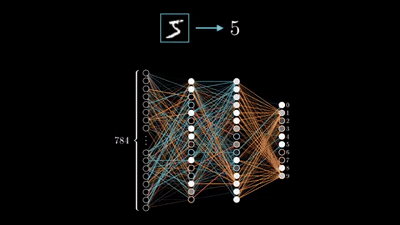

  

<h2 align="center">Chirag Desai</h2>

Delivering production-ready ML solutions — from research and experimentation to deployment and scaling

  <a href="mailto:chirag.d314@gmail.com">Email</a> • 
  <a href="https://www.kaggle.com/Chirag314">Kaggle</a>

  

---

## About Me

- 🔭 Building end-to-end machine learning systems with a focus on reproducibility, robustness, and real-world constraints  
- 🧠 Experienced in translating ambiguous problem statements into measurable ML objectives and evaluation strategies  
- 🧪 Strong emphasis on validation design, experiment tracking, and failure analysis to ensure reliable model performance  
- 🏗 Interested in scalable ML architectures, model lifecycle management, and production-grade workflows  
- 🤝 Open to senior ML engineering and applied data science roles with high ownership and impact

---

## Tech Stack

### Machine Learning & Data

### Deep Learning & Vision

### Experimentation & MLOps

### Platforms & Infrastructure

---

## GitHub Activity

  
  

  

