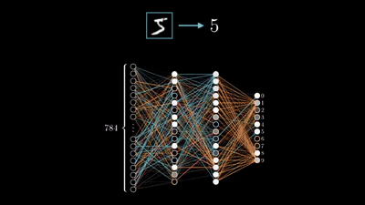

  

  

  <a href="mailto:chirag.d314@gmail.com">Email</a> • 
  <a href="https://www.kaggle.com/Chirag314">Kaggle</a> •
  <a href="https://www.linkedin.com/in/chiragd314">LinkedIn</a>

  

---

## About Me

<table>
<tr>
<td valign="top" width="55%">
<ul>
<li>🔭 Building end-to-end ML systems focused on reproducibility and real-world constraints</li>
<li>🧠 Translating ambiguous problem statements into measurable ML objectives and evaluation strategies</li>
<li>🧪 Strong emphasis on validation design, experiment tracking, and failure analysis</li>
<li>🏗 Scalable ML architectures, model lifecycle management, and production-grade workflows</li>
</ul>
</td>
<td valign="top" width="45%">
<b>📌 Current Focus</b>  
▸ Production ML pipelines 
▸ Model evaluation &amp; robustness 
▸ MLOps &amp; experiment tracking 
▸ Scalable training workflows 

</td>
</tr>
</table>

---

## Tech Stack

<h4 align="center">🧠 &nbsp; Machine Learning & Data</h4>

<table align="center">
  <tr>
    <td align="center" width="90">
       
      <b>Python</b>
    </td>
    <td align="center" width="90">
       
      <b>PyTorch</b>
    </td>
    <td align="center" width="90">
       
      <b>TensorFlow</b>
    </td>
    <td align="center" width="90">
       
      <b>Scikit-learn</b>
    </td>
    <td align="center" width="90">
       
      <b>NumPy</b>
    </td>
    <td align="center" width="90">
       
      <b>Pandas</b>
    </td>
    <td align="center" width="90">
       
      <b>Jupyter</b>
    </td>
    <td align="center" width="90">
       
      <b>HuggingFace</b>
    </td>
  </tr>
</table>

 

<h4 align="center">⚙️ &nbsp; MLOps & Infrastructure</h4>

<table align="center">
  <tr>
    <td align="center" width="90">
       
      <b>Docker</b>
    </td>
    <td align="center" width="90">
       
      <b>AWS</b>
    </td>
    <td align="center" width="90">
       
      <b>Linux</b>
    </td>
    <td align="center" width="90">
       
      <b>Git</b>
    </td>
    <td align="center" width="90">
       
      <b>GitHub</b>
    </td>
    <td align="center" width="90">
       
      <b>VS Code</b>
    </td>
    <td align="center" width="90">
       
      <b>Kaggle</b>
    </td>
    <td align="center" width="90">
       
      <b>W&amp;B</b>
    </td>
    <td align="center" width="90">
       
      <b>TorchVision</b>
    </td>
  </tr>
</table>

---

## GitHub Activity

  

  
  

  

  

---

## 🎮 Contribution Tetris

  

  

